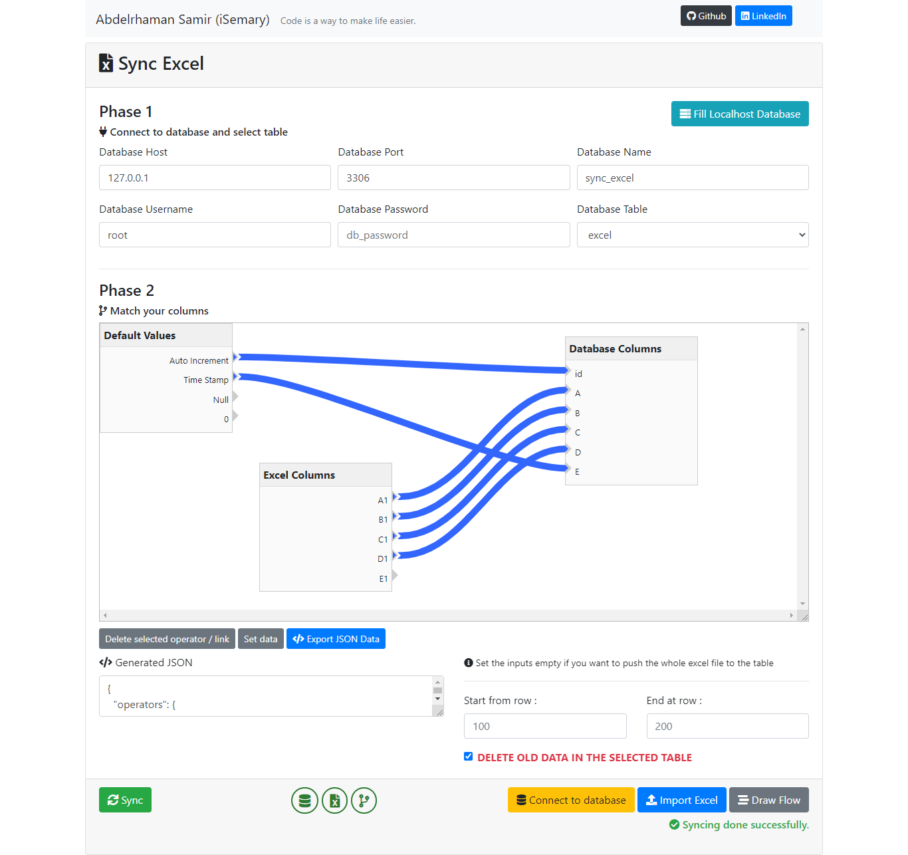

# Sync Excel

## Preview
 
 

 
 

## How to use

- Clone the repository
- Fillout the database configuration inputs
- Click **Connect to database** button
    - To validate the database connection
- Select the table from select box
- Import your excel file
- Click **Draw Flow** button
- Match your column by values
- After complete matching your columns :
    - Click **Export JSON data**
        - **Optional**
        - Choose the start and end row
        - Click on delete old data checkbox if you want to delete the old rows in the table
- Finally Click **Sync** button  